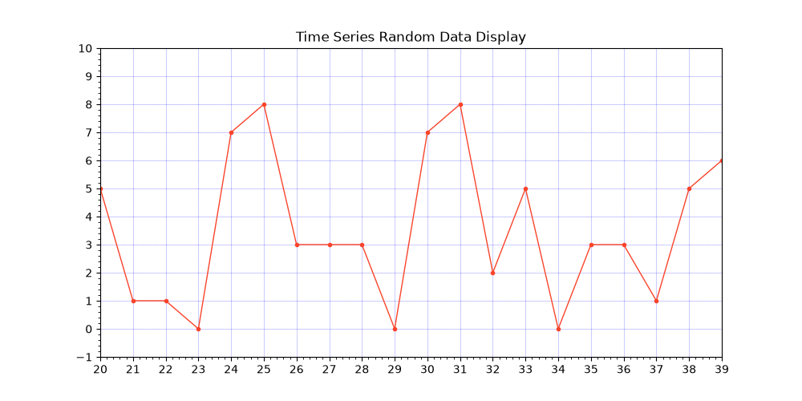

# Matplotlib Library Crash Course for Absolute Beginner

A beginner friendly collection of Python examples for learning how to create, customize, organize, and animate line charts using Matplotlib Library and Python.

This tutorial will help you learn the basics of plotting data on a Matplotlib Window coming from an external device like Arduino,Labjack DAQ or other Data acquisition system.

## Tutorial

- [Matplotlib Library Crash Course for Absolute Beginner](https://github.com/xanthium-enterprises/Matplotlib-Plotting-Crash-Course-for-Absolute-Beginner)

## What you will Learn 

- Installing Matplotlib
- Understanding Figure and Axes
- Creating basic line charts using Matplotlib Library 
- Customizing line styles, colors, and thickness
- Changing marker shapes and sizes
- Adding titles and axis labels 
- Creating legends
- Enabling and customizing grid lines
- Highlighting specific horizontal and vertical lines
- Controlling major and minor ticks on MatplotLib
- Using MultipleLocator to place ticks automatically
- Creating multiple plots in one figure
- Creating 2×2 subplot layouts
- Understanding the basics of real-time line-chart animation in Matplotlib Library

## Real-Time Line Chart Animation using Matplotlib Library and Python.

The tutorial also introduces the idea of animating a line chart for data received from an external source such as an Arduino or [data acquisition system](https://www.youtube.com/watch?v=hpHv4Iux6_s).

This is particularly useful for applications such as

- Sensor monitoring
- Temperature logging
- Real-time voltage/current monitoring
- Arduino projects
- Raspberry Pi projects
- Data acquisition systems
- Embedded-system dashboards

Matplotlib provides the FuncAnimation class for updating plots repeatedly as new data becomes available.

## References

- [Build your own Data Acquisition and Logging System to CSV file using Python and Arduino](https://www.xanthium.in/python-data-acquisition-system-daq-arduino-log-to-csv-file)

- [GUI Serial port Data Logging System to CSV text file using Python and tkinter (ttkbootstrap)](https://www.xanthium.in/multithreading-serial-port-data-acquisition-to-csv-file-using-producer-consumer-pattern-python)

- [Real-Time Line Chart Animation using Matplotlib Library and Python](https://www.xanthium.in/creating-animating-line-charts-matplotlib-absolute-beginners)